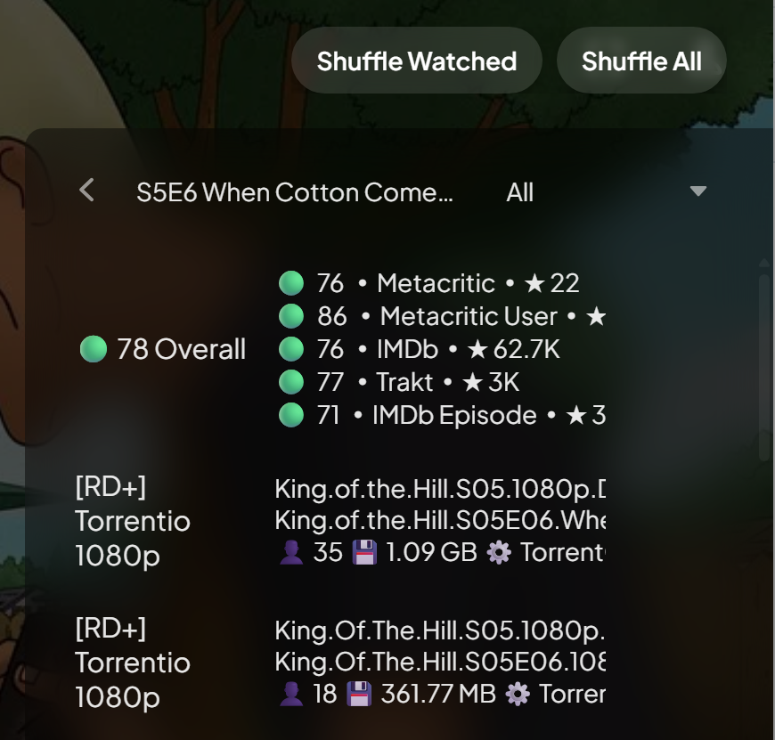
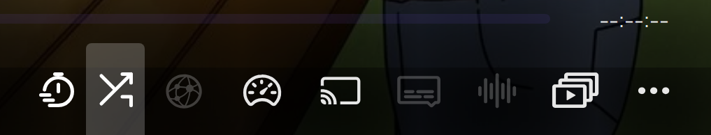

# Stremio Enhanced Series Shuffle

**Shuffle episodes effortlessly within Stremio Enhanced — ONLY works on the Enhanced client.**

---

## Description

Adds a **Shuffle Watched / Shuffle All** experience to Stremio Enhanced, complete with a sleek **Shuffle Next** toggle inside the player controls and fully randomized autoplay.

_Note: Not compatible with the default Stremio desktop/web/mobile/TV apps._

---

##  Features

- **Series Page Controls**  
  - Shuffle only watched episodes  
  - Shuffle all episodes (watched or not)

- **In-Player Shuffle Toggle**  
  - Appears in the player control bar (fades with UI)  
  - Enables randomized autoplay for the next episode  
  - Toggleable mid-session — retains per-series shuffle mode

- **Autoplay Behavior**  
  - Truly random episode selection when shuffle is on  
  - Works alongside Stremio Enhanced's “Up Next” UI (but does not modify it directly)

- **Session Storage**  
  - Shuffle setting persists per series for up to 24 hours

---

##  Installation (for Stremio Enhanced)

1. Download the [`series-shuffle.user.js`](series-shuffle.user.js) script from the [Releases](https://github.com/YOUR_USERNAME/stremio-enhanced-series-shuffle/releases) section.  
2. Open **Stremio Enhanced**.  
3. Navigate to **Settings → Enhanced → Plugins**.  
4. Click **Load plugin from file**, then select `series-shuffle.user.js`.  
5. Ensure the plugin is enabled.

---

##  Usage

- **Series Page**  
  - Click **Shuffle Watched** or **Shuffle All** to begin.

- **Player**  
  - Click the **shuffle icon** in the control bar to enable/disable next-episode shuffling.

---

##  Screenshots

| Series Page Shuffle Controls | Shuffle Toggle in Player Bar |
|------------------------------|-------------------------------|
|  |  |

---

##  Changelog

See [CHANGELOG.md](CHANGELOG.md) for version history.

---

##  Troubleshooting

- **“No episodes to shuffle”**  
  Occurs if episode metadata isn't loaded. Try navigating to the series detail page again or use a different source.

- **Shuffle icon misaligned or not visible**  
  Verify you are using **Stremio Enhanced**, not the official client.

- **Next episode still sequential?**  
  Ensure shuffle is turned **ON** via the icon; autoplay will shuffle correctly thereafter.

---

##  Contributing

- Found an issue? Open an [Issue](https://github.com/399iejijw9e29ejiwjljasd/stremio-enhanced-series-shuffle/issues).  
- Want to contribute? Pull requests are welcome!

---

## License

This project is licensed under the **MIT License** — see [LICENSE](LICENSE) for details.

---

*Made with ♥ for Stremio Enhanced users.*
