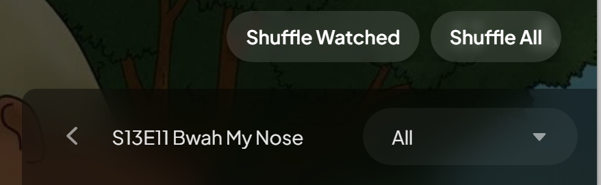

# Stremio Series Shuffle (Stremio Enhanced Only)

This userscript adds **true shuffle support for episodes** in the Stremio Enhanced web client.

> ⚠️ **Note**: This only works on the **Stremio Enhanced** web client. It will not work on the official desktop, mobile, or standard web clients.

## Features
- **Shuffle Watched** or **Shuffle All** episodes from the series detail page.
- In-player **shuffle toggle button** that disappears with the rest of the controls.
- **Randomized auto-play** for the next episode when shuffle is enabled.
- Works with **Up Next** overlay (when Stremio Enhanced is used).
- Session persists for up to 6 hours.

## Installation
1. Install a userscript manager like **Tampermonkey** or **Violentmonkey** in your browser.
2. Download and install the [`series-shuffle.user.js`](series-shuffle.user.js) script.
3. Open Stremio Enhanced and enjoy.

## Usage
- On the series page, click **Shuffle Watched** or **Shuffle All** to start.
- Inside the player, toggle the shuffle button (bottom control bar) on/off to control randomized next episode playback.

## Screenshots

## Changelog
See [CHANGELOG.md](CHANGELOG.md).

## License
This project is licensed under the MIT License - see the [LICENSE](LICENSE) file for details.
